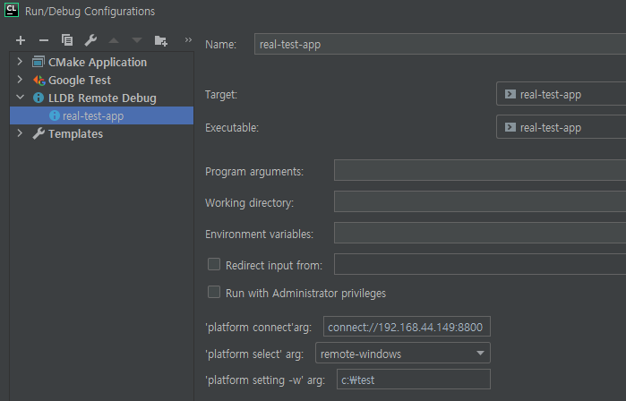

# Remote LLDB

Forked from [https://gitee.com/freezeall/LLDBRemote](https://gitee.com/freezeall/LLDBRemote).

This plugin enables remote debugging with LLDB in CLion.

# Usage

CLion:



Target:

```powershell
PS C:\Users\User> while ( 1 )  { Start-Process -FilePath "C:\Program Files\LLVM\bin\lldb-server.exe" -ArgumentList "platform --listen *:8800" -Wait -NoNewWindow; }
```

# License

Apache License 2.0
